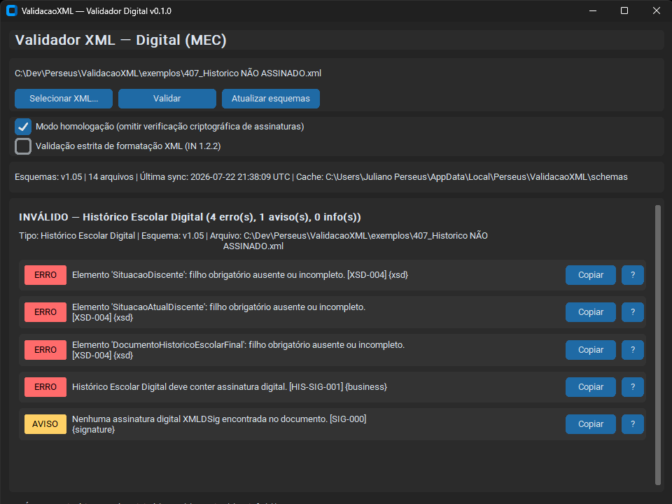

# ValidacaoXML — Validador Digital (MEC)

[](https://www.python.org/)
[](CHANGELOG.md)
[](#licença)

Aplicativo desktop em Python para validar arquivos XML do **Diploma Digital** conforme a especificação técnica do [MEC](https://www.gov.br/mec/pt-br/diploma-digital) (pacote XSD **v1.05**, [IN nº 5/2022](https://www.gov.br/mec/pt-br/diploma-digital/documentos/in-05-versao-completa-anexos-i-ii-e-iii-v1-05.pdf)).

O validador combina verificação estrutural (XSD), regras de negócio da instrução normativa, checagem de assinaturas digitais XMLDSig/XAdES com certificados ICP-Brasil e sincronização automática de esquemas com o portal oficial — tudo em uma interface gráfica moderna para Windows.



> **Aviso:** este é um projeto independente, desenvolvido pela comunidade. Não é um produto oficial do MEC nem substitui o [verificador online do governo](https://verificadordiplomadigital.mec.gov.br/diploma).
>
> **Estabilidade:** o aplicativo está em versão inicial (**v0.1.0**) e **não foi amplamente testado** em produção. Podem ocorrer falhas, resultados incorretos ou comportamentos inesperados. Use como ferramenta de apoio à validação e confirme resultados críticos com o verificador oficial do MEC ou com testes adicionais antes de decisões que tenham impacto jurídico ou operacional.

> **Só quer usar o app?** Na raiz do repositório há o [`ValidacaoXML_0.1.0.zip`](ValidacaoXML_0.1.0.zip) com o executável Windows — basta extrair e abrir `ValidacaoXML.exe`, sem instalar Python. Veja [Uso rápido](#uso-rápido-somente-executável).

---

## Índice

- [Funcionalidades](#funcionalidades)
- [Tipos de documento suportados](#tipos-de-documento-suportados)
- [Stack tecnológica](#stack-tecnológica)
- [Arquitetura](#arquitetura)
- [Requisitos](#requisitos)
- [Instalação](#instalação)
- [Uso rápido (somente executável)](#uso-rápido-somente-executável)
- [Uso](#uso)
- [Opções de validação](#opções-de-validação)
- [Relatório de validação](#relatório-de-validação)
- [Cache de esquemas XSD](#cache-de-esquemas-xsd)
- [Certificados ICP-Brasil](#certificados-icp-brasil)
- [Build do executável Windows](#build-do-executável-windows)
- [Desenvolvimento](#desenvolvimento)
- [Estrutura do projeto](#estrutura-do-projeto)
- [Referências oficiais](#referências-oficiais)
- [Licença](#licença)

---

## Funcionalidades

| Recurso | Descrição |
| --- | --- |
| **Validação XSD** | Estrutura, tipos e cardinalidade conforme os 14 arquivos do pacote oficial v1.05 |
| **Regras de negócio** | Ambiente de emissão, identificadores, versão do leiaute, formatação XML (IN 1.2.2) e exigência de assinaturas em Produção |
| **Assinaturas digitais** | Verificação XMLDSig/XAdES com classificação **Aprovada**, **Indeterminada** ou **Reprovada** |
| **ICP-Brasil offline** | Cadeia de certificação validada com AC-Raiz v5, v10 e v13 embutidas |
| **Sincronização de XSDs** | Download e cache local dos esquemas publicados no portal do MEC |
| **Mensagens em português** | Erros XSD traduzidos e contextualizados (ex.: `http://` vs `https://`) |
| **Ajuda contextual** | Botão **?** em cada ocorrência com explicação da regra e orientação de correção |
| **Modo homologação** | Omite verificação criptográfica de assinaturas para testes em ambiente de desenvolvimento |
| **Interface gráfica** | Tema claro/escuro automático (CustomTkinter), cópia rápida de mensagens |
| **Executável Windows** | Build com PyInstaller (pasta ou arquivo único) |

---

## Tipos de documento suportados

O tipo é detectado automaticamente pelo elemento raiz do XML:

| Documento | Elemento raiz | Esquema principal |
| --- | --- | --- |
| Diploma Digital | `Diploma` | `DiplomaDigital_v1.05.xsd` |
| Documentação Acadêmica | `DocumentacaoAcademicaRegistro` | `DocumentacaoAcademicaRegistroDiplomaDigital_v1.05.xsd` |
| Histórico Escolar Digital | `HistoricoEscolar` | `HistoricoEscolarDigital_v1.05.xsd` |
| Currículo Escolar Digital | `CurriculoEscolar` | `CurriculoEscolarDigital_v1.05.xsd` |
| Lista de Diplomas Anulados | `ListaDiplomasAnulados` | `ListaDiplomasAnulados_v1.05.xsd` |
| Arquivo de Fiscalização | `ArquivoFiscalizacao` | `ArquivoFiscalizacao_v1.05.xsd` |

Cada esquema principal referencia leiautes (`leiaute*.xsd`), tipos básicos (`tiposBasicos_v1.05.xsd`) e o schema XMLDSig (`xmldsig-core-schema_v1.1.xsd`).

---

## Stack tecnológica

| Camada | Tecnologia | Uso |
| --- | --- | --- |
| **Linguagem** | Python 3.11+ | Core da aplicação |
| **Interface** | [CustomTkinter](https://github.com/TomSchimansky/CustomTkinter) 5.x | GUI desktop multiplataforma |
| **Tema** | [darkdetect](https://github.com/albertosottile/darkdetect) | Detecção automática claro/escuro |
| **XML / XSD** | [lxml](https://lxml.de/) 5.x | Parsing, validação XSD e XPath |
| **Assinaturas** | [signxml](https://github.com/XML-Security/signxml) 4.x + [cryptography](https://cryptography.io/) | Verificação XMLDSig/XAdES |
| **HTTP** | [httpx](https://www.python-httpx.org/) | Download de XSDs e certificados |
| **Empacotamento** | [PyInstaller](https://pyinstaller.org/) 6.x | Executável Windows |
| **Testes** | [pytest](https://pytest.org/) 8.x | 26 testes automatizados |
| **Build** | setuptools | Instalação editável (`pip install -e`) |

---

## Arquitetura

O fluxo de validação é orquestrado pelo `ValidationPipeline` em quatro etapas sequenciais:


1. **Detecção** — identifica o tipo pelo elemento raiz (`detector.py`).
2. **XSD** — valida estrutura contra o esquema em cache (`xsd_validator.py`).
3. **Regras de negócio** — aplica regras específicas por documento (`business_rules/`).
4. **Assinaturas** — verifica XMLDSig com políticas ICP-Brasil (`signature/`).

Cada ocorrência é classificada em **Erro**, **Aviso** ou **Info**, com código de regra (`rule_id`), camada (`xsd`, `business`, `signature`, etc.) e caminho XPath quando aplicável.

---

## Requisitos

- **Python** 3.11 ou superior
- **Windows 10/11** — para o executável empacotado
- **Qualquer SO com Python** — para execução em modo desenvolvimento (Linux/macOS suportados para o core; a GUI usa Tkinter)

---

## Instalação

### Uso rápido (somente executável)

Para quem **apenas quer usar o aplicativo** — sem clonar o repositório, instalar Python ou compilar nada — há um pacote pronto na raiz do projeto:

| Arquivo | Conteúdo |
| --- | --- |
| [`ValidacaoXML_0.1.0.zip`](ValidacaoXML_0.1.0.zip) | `ValidacaoXML.exe` (executável único, Windows) |

**Passos:**

1. Baixe o arquivo `ValidacaoXML_0.1.0.zip` (na raiz deste repositório ou via [Releases](https://github.com/jsballarini/ValidacaoXML_MEC/releases)).
2. Extraia o ZIP em uma pasta de sua preferência.
3. Execute `ValidacaoXML.exe`.

Não é necessário Python nem instalação adicional. Na primeira execução, o app cria o cache de esquemas XSD em `%LOCALAPPDATA%\Perseus\ValidacaoXML\schemas\`.

> Este é um software em estágio inicial: **não foi amplamente testado** e podem ocorrer falhas. Em caso de dúvida sobre um resultado, valide também no [verificador online do MEC](https://verificadordiplomadigital.mec.gov.br/diploma) ou abra uma issue no repositório.

> O Windows pode exibir aviso de “aplicativo desconhecido” em executáveis não assinados. Use **Mais informações → Executar assim mesmo** se confiar na origem do arquivo.

### Desenvolvimento (código-fonte)

```powershell
git clone https://github.com/jsballarini/ValidacaoXML_MEC.git
cd ValidacaoXML

python -m venv .venv
.venv\Scripts\Activate.ps1
pip install -e ".[dev]"
```

No Linux/macOS, substitua a ativação do venv por `source .venv/bin/activate`.

### Gerar o executável localmente

Se preferir compilar você mesmo em vez de usar o ZIP da raiz, consulte a seção [Build do executável Windows](#build-do-executável-windows).

---

## Uso

### Interface gráfica (executável ou desenvolvimento)

Abra o `ValidacaoXML.exe` extraído do ZIP **ou**, em modo desenvolvimento, execute:

```powershell
validacao-xml
# ou
python -m validacao_xml.main
```

### Passo a passo

1. Clique em **Selecionar XML...** e escolha o arquivo `.xml`.
2. (Opcional) Marque as opções de validação desejadas (ver seção abaixo).
3. (Opcional) Clique em **Atualizar esquemas** para sincronizar XSDs com o portal do MEC.
4. Clique em **Validar**.
5. Revise o relatório: erros impedem a validação; avisos e informações orientam ajustes.

---

## Opções de validação

| Opção | Padrão | Efeito |
| --- | --- | --- |
| **Modo homologação** | Desmarcado | Quando marcado, localiza assinaturas mas **omite** a verificação criptográfica (útil em ambientes de teste) |
| **Validação estrita de formatação XML (IN 1.2.2)** | Desmarcado | Quando marcado, verifica ausência de comentários, espaços entre tags e quebras de linha/tabulação |

---

## Relatório de validação

O painel de resultados exibe um resumo (`VÁLIDO` / `INVÁLIDO`) e lista cada ocorrência com:

- **Severidade** — ERRO (vermelho), AVISO (amarelo) ou INFO (azul)
- **Mensagem** — descrição em português
- **Código** — identificador da regra, ex.: `[XSD-004]`, `[HIS-SIG-001]`
- **Camada** — origem: `xsd`, `business`, `signature`, `parse`, etc.
- **Copiar** — copia a mensagem para a área de transferência
- **?** — abre ajuda contextual com explicação e orientação

### Códigos de regra (principais)

| Prefixo | Camada | Exemplos |
| --- | --- | --- |
| `XML-*` | Parse | XML malformado ou ilegível |
| `DET-*` | Detecção | Tipo de documento não reconhecido |
| `XSD-*` | Esquema | Estrutura inválida, versão incompatível |
| `FMT-*` | Formatação | Comentários ou espaços vedados (IN 1.2.2) |
| `SIG-*` | Assinatura | Ausência ou resultado da verificação |
| `DIP-*`, `DOC-*`, `HIS-*`, `CUR-*`, `LST-*`, `FIS-*` | Negócio | Regras por tipo de documento |
| `*-AMB-001` | Negócio | Documento emitido fora de Produção |

---

## Cache de esquemas XSD

Os esquemas são armazenados localmente em:

```
%LOCALAPPDATA%\Perseus\ValidacaoXML\schemas\
```

Na primeira execução, o aplicativo:

1. Copia os XSDs **embutidos** no pacote (`src/validacao_xml/schemas/bundled/`).
2. Tenta sincronizar versões mais recentes com o [portal do MEC](https://www.gov.br/mec/pt-br/diploma-digital/dados).
3. Registra versão, data da última sync e hash SHA-256 de cada arquivo (`manifest.json`).

A barra de status da interface exibe a versão dos esquemas em uso, quantidade de arquivos e caminho do cache.

Para atualizar manualmente os XSDs embutidos no repositório (desenvolvedores):

```powershell
python scripts/download_schemas.py
```

---

## Certificados ICP-Brasil

A verificação offline de assinaturas utiliza as AC-Raiz oficiais:

- **v5**, **v10** e **v13** — repositório [AC-Raiz — ITI](https://www.gov.br/iti/pt-br/assuntos/repositorio/repositorio-ac-raiz)

Arquivos em `resources/icp_brasil/`. O script de build baixa automaticamente as versões atuais. Para atualizar manualmente:

```powershell
python scripts/download_icp_certs.py
```

Sem os certificados raiz locais, assinaturas podem ser classificadas como **Indeterminada** quando a cadeia não puder ser verificada offline.

---

## Build do executável Windows

Requer dependências de desenvolvimento (`pip install -e ".[dev]"`).

### Pasta com executável (inicialização mais rápida)

```powershell
.\scripts\build_exe.ps1
```

Saída: `dist\ValidacaoXML\ValidacaoXML.exe`

### Arquivo único para distribuição

```powershell
.\scripts\build_exe_unico.ps1
```

Saída: `dist\ValidacaoXML.exe`

Os scripts de build também baixam XSDs e certificados ICP-Brasil antes de empacotar.

---

## Desenvolvimento

### Executar testes

```powershell
pytest
```

Cobertura atual: validação XSD, regras de negócio, assinaturas, sincronização de esquemas, detecção de documentos e mensagens de erro.

### Convenções

- [Semantic Versioning](https://semver.org/) para releases
- [Conventional Commits](https://www.conventionalcommits.org/) para mensagens de commit
- [Keep a Changelog](https://keepachangelog.com/) — ver [CHANGELOG.md](CHANGELOG.md)

---

## Estrutura do projeto

```
ValidacaoXML/
├── ValidacaoXML_0.1.0.zip     # Executável pronto para uso (sem Python)
├── docs/
│   └── ValidacaoXML.png          # Captura de tela da interface
├── resources/
│   └── icp_brasil/               # Certificados AC-Raiz ICP-Brasil
├── scripts/
│   ├── build_exe.ps1             # Build PyInstaller (pasta)
│   ├── build_exe_unico.ps1       # Build PyInstaller (arquivo único)
│   ├── download_icp_certs.py     # Atualiza certificados ICP-Brasil
│   └── download_schemas.py       # Baixa XSDs do portal MEC
├── src/validacao_xml/
│   ├── core/
│   │   ├── business_rules/       # Regras por tipo de documento
│   │   ├── signature/            # Verificação XMLDSig e ICP-Brasil
│   │   ├── detector.py           # Detecção do tipo de XML
│   │   ├── pipeline.py           # Orquestração da validação
│   │   └── xsd_validator.py      # Validação contra XSD
│   ├── gui/
│   │   ├── app.py                # Janela principal
│   │   ├── components.py         # Painel de resultados
│   │   └── issue_help.py         # Ajuda contextual por código
│   ├── schemas/
│   │   ├── bundled/              # XSDs embutidos (v1.05)
│   │   ├── manifest.json         # Metadados e hashes dos esquemas
│   │   └── sync.py               # Sincronização e cache
│   ├── config.py
│   └── main.py                   # Ponto de entrada
├── tests/                        # Testes automatizados (pytest)
├── CHANGELOG.md
├── pyproject.toml
└── README.md
```

---

## Referências oficiais

- [Pacote XSD v1.05 — MEC](https://www.gov.br/mec/pt-br/diploma-digital/dados)
- [IN nº 5/2022 (v1.05) — texto completo e anexos](https://www.gov.br/mec/pt-br/diploma-digital/documentos/in-05-versao-completa-anexos-i-ii-e-iii-v1-05.pdf)
- [Verificador online MEC](https://verificadordiplomadigital.mec.gov.br/diploma)
- [Repositório AC-Raiz — ITI](https://www.gov.br/iti/pt-br/assuntos/repositorio/repositorio-ac-raiz)

---

## Licença

Este projeto está licenciado sob a **MIT License**.
